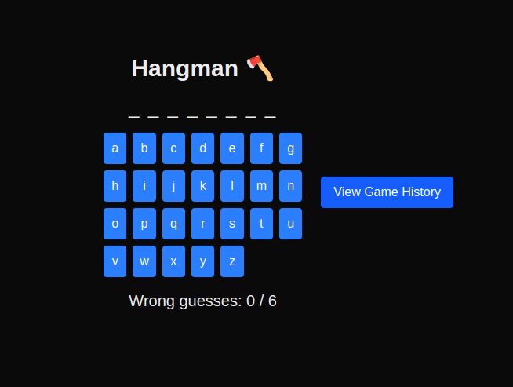
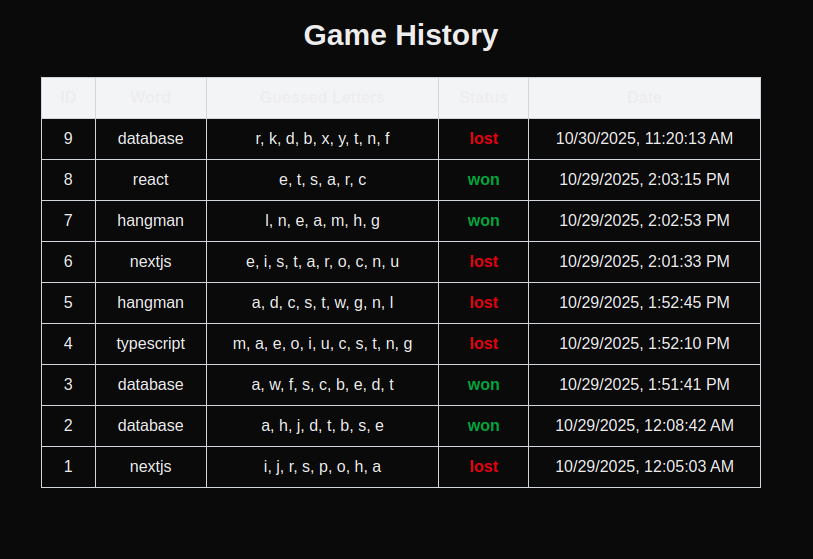

# Docker Hub

## Télécharger l'Image

Vous pouvez accéder à l'image publique sur [Docker Hub](https://hub.docker.com/r/alinad2912/hangman) ou la télécharger directement :

```
sudo docker pull alinad2912/hangman:latest
```

## Exécuter le Conteneur

Lancez l'image localement avec :

```
docker run -p 3000:3000 alinad2912/hangman:latest
```
## Accéder au Jeu

Une fois le conteneur lancé, ouvrez votre navigateur et accédez à :
```
http://localhost:3000
```

## Captures d'Écran

Interface Principale du Jeu :



Historique des Parties :

